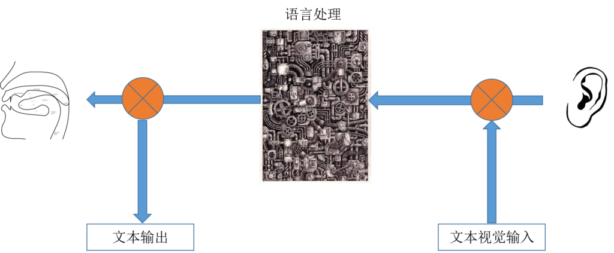
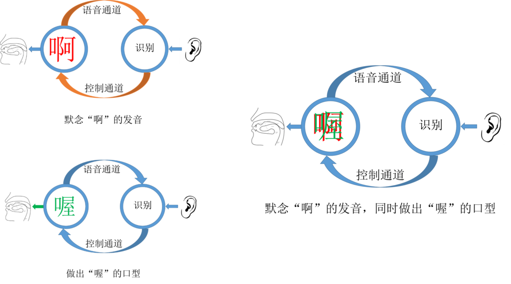

## 听说能力很重要，比你想象的还要重要得多

***

#### 引子：

我们先来做一个小实验，我不会一开始就告诉你为什么要做这个实验，简单照做就好了，指示很简单：默念“啊”的发音，同时做出“喔”的口型（不要实际发出声音，仅仅是做个口型）。

好了，不要问为什么，这篇文章里会有解释的。

### 一 语音为什么如此重要？

#### 进化的视角：

人类的文字，可追溯到9000年前，但人类语言的历史，至少有9万年，如果把标准放宽，更早就有较复杂（相对动物而言）的语音沟通了。在文字发明之前，人们都是用语音交流，以口口相传的故事传承传统，积淀文明，这可以从进化论上解释，人类对语音的处理能力为什么要比对文字的处理能力强得多。

#### 儿童语言发展：

从儿童的语言能力发展来看，也是首先发展了听说交流的能力，然后才在学校中学习阅读和写作，还有相当一部分儿童患有阅读障碍症。这也暗示着，文字处理对人类来讲，还是一个更新，更不容易掌握的技能。

#### 儿童语言发展：

从儿童的语言能力发展来看，也是首先发展了听说交流的能力，然后才在学校中学习阅读和写作，还有相当一部分儿童患有阅读障碍症。这也暗示着，文字处理对人类来讲，还是一个更新，更不容易掌握的技能。

#### 哑巴英语为何反人类：

在不正确的学习方法中，有人记忆了大量的单词，但这些单词都是以视觉编码的形式保存在记忆中。

首先，对于语言来说，视觉记忆难度远高于听觉记忆，效率很低，简直是反人类的记忆方法，半途而废才是正常人类，所以坚持不下来的同学也不要因为自己缺乏所谓的意志力而内疚不已了。

其次，即使有人靠坚强的意志力，以视觉方式记忆了大量单词，也只能称这些单词为“阅读词汇”。这些单词的语义，是以字形为线索存入大脑的，这个过程极少有语音的参与，要提取所记忆词汇的意义，也只能用字形来激活。记住的单词并没有成为“听力词汇”，听到这些单词的发音时，不会激活对应的语义，这带来的后果是：当单词的语音在语流中出现时，根本来不及反应，听力还是没有随着单词量的增加而增长。

#### 听说是读写的基础：

下图展示了一个高效率的语言加工系统：

在这个系统中，语言处理主要是以语音的方式进行的，碰到阅读和写作时，只不过增加了从视觉到听觉，从听觉到动作的接口转换，通过这个转换，我们依然能够应用原有的语言处理系统，来处理阅读和写作。这是一种高效的，节省资源的工作方式。

从这一点来看，阅读和写作，也需要以良好的听说能力为基础，或者，严格地说，最有效率的方式，是以良好的听说能力为基础。

好在，英语是一种拼音文字，在很大程度上，字形是可以和发音相对应的，这体现为“拼读”（Phonics），国内一般叫自然拼读。拼读的意思是，当你看到一个单词的字形时，不论单词是否认识，基本可以读出这个单词的发音。在写作时，也是先获取单词的发音，然后按照发音拼写出单词。

在阅读中，由于字形本身就能够激活听觉反应，这种脑内听觉的产生，顺利地将文字形式的语言转换为语音，接入强大而成熟的语音处理系统，这能够帮助我们更加顺利地阅读文章，理解语义。一些文学体裁或作品，非常讲究语言的音乐性，这显然要通过听觉才能感受到，这也提示我们，阅读时的语音处理过程有多重要。

打一个通俗的比方，语言的语音加工是皮，文字加工是毛，皮之不存，毛将焉附？不首先培养出以语音方式输入与输出英语的能力，阅读和写作的提高，也会碰到很大的困难。在这种条件下，即使能培养出一定程度的读写能力，加工方式也迥异于母语者，后患无穷。

从教学上看，我们强调语音，可以总结为这样两个原因：

##### 第一：效率原因

大脑对语音的处理能力更为强大，更符合母语者模式，在学习效率上高于视觉方式学习的哑巴英语。

##### 第二：听说是读写的基础

我们不是因为学习者普遍听说差才去强调听说。如果这样，有人会因为自己只需要阅读写作而不去练习语音，这种做法同样是错误的。听说本来就是读写的基础，以任何目的学习英语，首先就要从语音入手，这才是正确的途径。

### 二 英语语音流的构成

英语的语音流，是一个复杂的多层次组合，在上一篇文章中，我强调了音位意识做为基础的作用，但仅有音位意识是远远不够的。

见这样一句话：Would you like to leave a message?

在我们的大脑中，这句话所对应的语音流，并不会被直接看做音位的依次连接，而大致是这样的一个层次结构：

有些短语结构比如would you like，由于高频重复，已经成为了一个固定的模块。对于多音节单词message来说，会把音节当作下层模块，而不是音位。

语音加工，包括识别和输出（发音），是在多个层次上进行的。根据认知理论，这种加工过程并不是先识别最小单元（音位），然后再组合，而是多个层次上并行处理，加工的顺序，也不是从底层到高层，从下至上和从上至下的过程同时存在，相互影响。

### 三 语音训练的目标

#### 1 模块与复用

在计算机软件开发中，复用是一个重要的主题，复用所能够带来的好处也无需多言，我们的整个工业化生产制造，大量依赖各类标准件，这也很好地体现了复用的威力。

这些模块复用系统的运作效率，其实远远不如人脑，人脑才是模块复用的超级大师。人脑的神奇之处在于，不论哪个系统里有可以再次加以利用的模块，只要稍加提示和训练，人脑就可以将可利用的部分分离出来，用于新的场合，其柔性之强，组合之灵活，是人造系统完全不能比拟的。你也许完全没有想过，同样是行走的动作控制，我们可以看做一个大的模块，这个动作可以在平地上进行，可以在坎坷的地面上进行，可以上台阶，可以走下坡路，略加变化变成小跑，和其他控制模块，例如搜寻，躲避一起运作，可以组合成千变万化的活动。如果你还没有领会，那么可以想一下，机器人为什么会在双足行走上碰到如此之大的困难？

在语音流的层次结构图中的每个层次上，模块意识都很重要。

以音位意识为例，这也是在最基础的层次上，模块意识的体现，如果完全缺乏音位意识，直接去听和模仿单词发音，那么每一个单词，都是一个需要重新模仿的对象。如果形成了明确的音位意识，你只需把学到的音位进行某种组合即可。这大大减轻了学习负担。

#### 2 训练目标

语音训练的目标，就是在各个层次都形成一致的，可以供上层重复利用的语音模块，这种模块的形成，会大大减轻人脑处理语音的难度，对于语音的输出来说，也使得输出具有一致性，哪怕发音在一定程度上偏离英美标准发音（比如印度英语），只要对方适应了你的发音习惯，就不会有大的听力障碍了。从这一点上讲，我们可以说发音是否标准并不重要，这在具有口音一致性的前提条件下，是可以成立的，但这绝对不是逃避发音训练的借口。

虽然认知加工是上行和下行通道并行，但训练的过程中，大的模块的训练，肯定是以小模块的熟练掌握为基础，也就是按照音位，单音节，多音节的顺序进行，不能略过音位练习去学音节，但学习了音节之后，需要回顾音节中的音位，具体方法在以后的文章中会提到。

很可惜的是，英语的语音并不是像文字那样，将模块依次连接就可以了，因为发音器官的原因，连续发音时，发音会受到前后发音的影响。所以，我们除了熟练掌握模块之外，还需要掌握模块的连接方式。英语连续语音流中的其他特征也很重要，比如重音，节奏，语调变化等，这些连续语音流中的特征，在语音学里属于超音段的内容，意思是它不是时间轴上的组块，而是分布在语流中的特征，这在以后的文章中也会陆续提到。

一旦你熟练掌握了以上内容，能够流利地进行英语的连续发音，让英语不太好的人认为比较地道，这时就可以认为，专项的语音训练就结束了，再经过一段专门的拼读训练，形成拼读习惯之后，就可以进入单词，语法的学习。需要强调的是，专项虽然是结束了，但每个单词的发音，做为一个语音模块，也需要在学习单词时，通过多次重复发音的方式掌握。在后面的学习中，如果发现前面还有弱项，也需要时不时回到基础环节补足。

### 四 如何进行语音训练？

#### 1 自动化过程与控制过程

我们公司最近搬家了，为什么要提到这个事呢？因为一位同事说，她早上不知不觉就走到了以前要坐车的公交站，差点坐上了车，这就是一个典型的自动化过程，由于每天的重复而形成，在没有意识控制的时候也能自动完成。你们一定能举出更多的例子。

在技能学习领域，认知科学经常谈到这一对重要概念，自动化过程和控制过程。

自动化过程是指，那些不需要意识控制就能够完成的过程，技能熟练到一定程度就会发生这种现象。这也是大脑的一项重要功能，不要小看这一点，自动化过程的处理能力非常强大，我们可以把这种过程，比做计算机的协处理器，例如一个游戏显卡，一旦把任务转化为自动化过程，意识控制的负担就大大减轻了。人脑的神奇之处在于，它可以通过反复训练，不断地把任务分配过去，不断减轻意识控制的负担。

这一对概念，对英语语音训练也很重要。

一位教英语的老师告诉我，他教英语的时候，不怕哪些英语零基础的，最怕英语负基础的，所谓负基础，就是，英语没学得怎样，反而形成了一些非常坏的习惯，造成后面学习很大的障碍。这也就是说，他之前的英语学习成果为负。一般人虽然没有那么严重，但也形成了一些错误的发音习惯。

##### 解决旧习惯：从自动化过程到控制过程

既然是习惯，就是因为已经形成了自动化过程，你不去注意它，它就按照惯常的方式自动进行。为了纠正这个习惯，就得重新让这个过程被意识重新控制，对于音位发音来说，就是恢复对嘴型，舌位的主动控制，这个阶段是很困难的，会有邯郸学步的感觉，开始会导致发音重新变得不熟练，本来和人还能说两句，训练之后反而不会说了。即使这样，也一定要坚持，这是新习惯的基础。（当然，如果之前的发音要领没有大的问题，可以以后慢慢修正）

##### 培养新习惯：从控制过程到自动化过程

在意识控制下做出正确的发音动作，再大量重复，对于发音来说，就是形成肌肉记忆。这个阶段没有太多的捷径或者诀窍，大量重复是躲不掉的。在形成了自动化过程之后，你会有一些感觉，比如发音一致性提高了，不论一个音节出现在什么位置，你都会以相似的要领发音，发音更顺口了，不再需要努力控制，就可以按照新的正确方式发音了。这也意味着，一个新的语音模块在你的大脑中形成了。

#### 2 听说循环

很多老师都从输出的角度强调说的重要性，这是非常正确的，我试图从认知的角度，来说明这一点为什么很重要。

##### a、语音环（Phonological Loop）

回顾一下本文开头的引子：默念“啊”的发音，同时做出“喔”的口型。

我们在记忆单词时，经常会采取这种默念的方式，在脑子里一遍又一遍地回放发音，这属于听觉记忆过程，这在语音的短时记忆理论中，被称为“语音环”。

你一定记录过别人在电话里报给你的电话号码，在不方便手写记录的情况下，大多数人通常采用这样一种方式，先复述或默念一遍，过一小会感觉印象不深了再复述或默念一遍，直到你有条件记录下来为止。

我们记住一个语音时，不是记忆声音本身的具体特征，而是以说或默念的方式，形成一个回路。我们中的大多数人，之所以能够不出声默念，是因为在我们的大脑中，已经训练出了一个产生脑内语音的信号发生器，相关模块的框图可表示如下：

语音环就是图中那个环状的回路，从发音模块发出脑内语音（默念），通过语音通道到达识别模块，然后将识别结果通过控制通道发回发音模块。当语音信号在这个回路上循环不止的时候，就被保持下来了。

这个理论对教学的启示是：发音训练对短期记忆非常重要，通过发音训练形成的脑内发音模块，构成语音短期记忆不可缺少的一环。

现在我们来回答一下引子的问题，见下图：

我们的直接感受是，当默念的声音和嘴型不一致时，会觉得别扭，甚至难以完成这个任务。这意味着，脑子中一个地方产生了冲突。这个冲突的原因在于，这个语音信号发生器，基本上就是我们实际进行发音时，所用到的模块。这个仅仅在脑子里存在的信号发生器，甚至包括了对嘴部肌肉运动的控制。你在默念“啊”的时候，就是让这个信号发生器变成发“啊”的状态，而做出“喔”的口型，却又在同时让它变成发“喔”的状态。这就好像让一个人同时往左和往右一样难办。

##### b、 语音模式的识别

认知科学告诉我们，在模式识别的认知过程中，自下而上和自上而下的过程同时存在。

在语音识别中，自下而上是指，我们听到了声音的频率等特征，然后将特征组合起来识别为某个具体的音。

自上而下是指，对所要听到的声音的预期，会参与识别过程。这时，脑内的发音模块在其中也扮演了重要的角色。简单来说，如果音位意识得到加强，对英语语音流的预期能力就会更强，你只会在英语的合法音位内寻找匹配的对象，这样的预期会大大提高语音加工的速度和质量，容错性也更好。

#### 3 高频模块与低频模块

在传统的教学模式中，更注重例外规则的学习，而在我介绍的训练模式下，应更注重高频模块的加强。在单词这个层次上，

越是高频的词汇，如I，you，do，is，are，here，there，和高频的组合do you，I'm，he's，here's，就越要花时间熟练掌握。这完全符合语言的效率原则，把过多的精力花到低频组合上就没那么划算了。

### 五 如何进行基本音位的训练

前面的内容已经过多了，本来是要把这个环节放到下一篇来讲的，但考虑到有些读者已经翘首以待，就把后面这一篇的内容做为最后一部分，估计练习时间至少需要一到两个星期，以后再针对练习过程中的问题进行补充说明。

关于英音和美音问题，我会推荐美音，主要是因为美音的发音比较自然随意一些，英音对口腔肌肉控制要求更高。当然学英音肯定没问题，只不过资源什么的你就得自己找了。

#### 1 音位训练的目标

##### a 形成和加强音位意识，构造整个英语语音加工系统的基本单元
##### b 纠正不正确的嘴部发音运动方式，为将来的连续发音打下良好的基础

在连续语流中，发音会发生很多变化。如果音位的舌位本身就是错的，连续发音会变得困难，无法自然衔接，变化的方式也会变得和母语者不一样。这就是真正的问题了。

##### c 形成发音时嘴部运动的肌肉记忆，让发音具有一致性

在纠正了发音动作之后，在意识的控制下通过大量练习形成肌肉记忆，重新转化为自动化过程，让发音变得轻松自然。

肌肉记忆的形成，会让相同的发音变得具有一致性，这使得对方的语音识别过程更加容易。

#### 2 音位训练的流程及辅助工具

##### a 听力矫正

在进行基本音位训练时，最大的问题是，自己听不出来，我建议先进行一轮听力矫正。
幸好这样的专业软件已经有了，而且是免费的，这就是angel sound，有PC端程序，也有苹果上的APP，请访问他们的网站获取软件。

http://angelsound.tigerspeech.com/

##### b 恢复对嘴部运动和舌头位置的意识控制

##### 教学资源推荐

youtube上的教学视频：

https://www.youtube.com/user/rachelsenglish

先找单独的元音和辅音发音教程，不要看其他的

##### 发音的剖面图

http://soundsofspeech.uiowa.edu/english/english.html

对应的app页面：

http://soundsofspeech.uiowa.edu/

##### lisa美语教程

这个教程已经引进到国内，是收费的，但不是很高，这个教程同时包括了视频讲解和剖面图，还有一些针对性的内容，可能对国内的学习者更方便。你们可以用关键词搜索一下。

在学习时，恢复控制对于很多人来说，是个难点，这里有两个小工具推荐给读者使用。

##### 镜子

女性常用的化妆镜，便于携带和使用，也很便宜，建议购入。

镜子是让你看到自己发音时的嘴部运动，和网上的视频对照。

##### 口香糖

听起来很奇怪，口香糖是帮助你掌握舌头位置的，很多人对自己的舌头位置已经失去了感觉，口腔内的异物能够帮助人重新感觉到舌头。你还可以用舌头让口香糖变成各种形状，找到各种舌位。

从学习方法上，有这么几点：

不必学习教师发音的细微特征，如果你对自己的发音要领和舌位有信心，那你的发音就是没问题的

这个阶段，如果感觉有困难，或者对某些发音不踏实，还是建议找一下专门的发音教师，不论是面对面还是视频，让教师听到你的发音，然后进行纠正，比你自己找半天最后练出一个错误的音来好得多。不推荐找没有受过专门音位发音训练的英语母语者，正好比我们未经培训也很难去教人汉语发音要领一样。

##### c 以上两个过程需要反复交替进行，反复练习。

没有别的诀窍，注意力高度集中在发音动作上，多次重复，最后形成肌肉记忆。

以什么方式来检验是否形成了肌肉记忆呢？只能靠自我感觉了：

发音时感觉轻松随意，不再有勉强地去憋一个发音的感觉

发音一致性很好，发同样的音，就是同样的标准动作

可以非常快速地把音标表对应的发音都复述出来

可以对发音做出各种变化，包括大声，小声，耳语，快和慢，升调或降调，而在变化的时候，不会改变发音的基本模式

##### d 开始重建自己的单词发音

平时接触到英语单词时，尝试用新的发音方式重建这个单词的发音，纠正原来的不正确方式，依然是大量重复练习形成肌肉记忆。

发音训练的路还很长，我先帮你到这里，如果已经迫不及待的话，那么就从这儿开始吧！