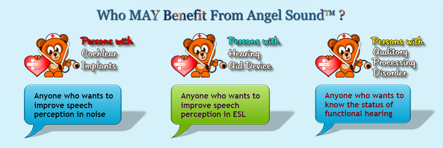
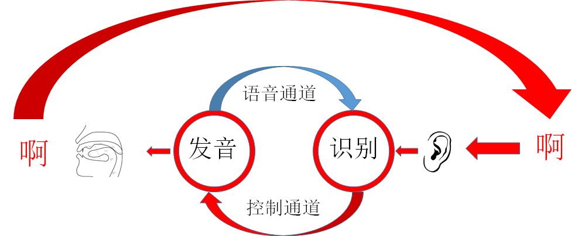
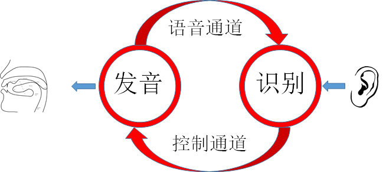

## 音位自我训练的原理与过程

***

音位练习会被很多老师强调，然而学生投入练习的时间却远远不够，原因不是学生不够努力。这个阶段会常常让练习者感觉到枯燥乏味，缺乏练习目标，缺乏反馈和激励，是重要的原因。

下面提出的自我训练方案，会尽可能地考虑到这一点，让学习者能够确定目标，在过程中也能够通过一定方式得到反馈和激励。

音位练习碰到的第一个困难，是学习者对自己的发音没有辨别能力，不能区分自己发出来的错误发音和正确发音，在没有教师一对一纠正时，不能及时纠正自己的发音错误。

我们首先要做的事情是，矫正自己的音位辨别能力。

### 一 音位听力矫正

音位矫正是针对大脑中的识别模块而进行的，方式是给出确定的一个标准发音，然后让你听到音之后做出判断，根据判断的正确和错误，可以得到及时的反馈。当识别模块对音位敏感之后，才能够对自己的发音起到正确的监控作用，这是自我训练不可缺少的基础。

在前面的文章中，我提到了angel sound这个软件，这个软件的网址在：

http://angelsound.tigerspeech.com/

软件是这样介绍的：

Angel Sound（TM） 是一个基于PC的交互式听力康复程序，TigerSpeech科技公司开发，经Emily Shannon Fu基金会赞助免费分发。该基金会是一个非营利机构，为纪念我们的安琪儿和深爱着的女儿Emily Fu而设。Emily帮助我们意识到，人间生命虽然短暂，但爱却是永恒的，帮助他人才是生命的真正意义。

软件现在也有了移动端，可以在手机里使用。该软件的初衷，是为帮助有听力障碍的儿童恢复听力，这个程序，恰好符合我们对初学者听力矫正的需要，在软件主页中列出了该软件面对的使用人群：

中间那项，就是针对ESL（English as Second Language），英语做为第二语言的学习者。

Angel Sound软件有很多功能，我们这里使用的，是辅音和元音的判断，主要有三个类型，辅音在前，辅音在后，中间的元音。在训练时，有几个难度梯度，最简单的是不加噪音，随着噪音的加大，题目难度也随之提高了。噪音也分为几种类型，可以进行选择。声音的播放速度也有几个等级，播放速度越快，难度越高。

这种加噪音辨别的科学性，在相关的论文中也有提及，大意就是，我们在辨别音位时，有可能只注意到了某些细节特征，而不管其他特征，通过噪音来掩盖一些特征，可以让你对其它特征更加敏感。通过这样的训练，可以让你在辨别时可以依赖更多的声音特征，让辨别更加迅速。哪怕仅仅从直观上理解，这至少可以让我们在有环境噪音的情况下辨别音位的能力有提高。

### 二 发音要领的掌握

之前的专栏中提到，发音练习的过程，就是：自动化过程--->控制过程--->自动化过程。

第一个自动化过程，就是指之前不正确的发音习惯，由于说得太多太久，已经完全自动化了，不需要意识控制来控制相关肌肉的运动。

为了得到正确的发音习惯，我们首先要让我们恢复对肌肉运动的控制，控制舌头的位置，控制声带振动，控制嘴型，确保以正确的方式发音。

伴随音位听力的矫正，发音要领的学习可以同时进行，即使你的听力还没有被矫正过来，也可以先行学习发音要领。这实际上是对下图中的发音模块进行预先的调整。

我们之前推荐了这样几个资源：

youtube上的教学视频：

https://www.youtube.com/user/rachelsenglish

先找单独的元音和辅音发音教程，不用看其他的。

发音的剖面图

http://soundsofspeech.uiowa.edu/english/english.html

对应的app页面：

http://soundsofspeech.uiowa.edu/

lisa美语教程

这个教程已经引进到国内，是收费的，但不是很高，这个教程同时包括了视频讲解和剖面图，还有一些针对性的内容，可能对国内的学习者更方便。你们可以用关键词搜索一下。

在利用上面的资源进行学习时，需要注意的是，在这里我们矫正的是发音动作本身，我们的注意力要集中在发音时的舌头位置，口腔肌肉的运动，嘴型。千万不要以为，我发出了一个好像一样的音就可以了，这是不对的，错误的发音动作会让你以后的连续发音碰到非常多的困难。

##### 1 发音要领中的舌位

首先是舌位，对照对应发音视频中，和网站上的剖面图，大多数人会碰到这样的困难，对舌头的位置已经没有感觉了，这里推荐一个很好的工具：口香糖。

口香糖的原理是，由于口腔内部和舌头都是自己的，很难通过触觉感觉位置，在口腔内放入一个异物，可以帮助我们通过内部的触觉来感受舌头的形状和位置，口香糖实在是一个非常好的选择。

除了通过口香糖感受位置之外，还可以用舌头来操作口香糖，把它变成不同的形状，放在不同的位置，以这种方式锻炼自己的舌头运动的控制。

##### 2 嘴型

嘴型也是非常重要的，这里不仅仅指嘴的形状，还指在发音时，从鼻子往下的面部运动，不仅包括嘴的形状。

好在嘴型是从外部可以看到的，这里推荐用一面镜子，观察自己发音时的嘴部运动，并与视频上的教师嘴型进行对比。

##### 3 r和l到底怎么发？

r和l，经常被称为卷舌音，但我们在口腔剖面图上，却看到在在发r音时，舌头并没有卷起来，而是舌头往回缩，舌根隆起，这是什么原因呢？

一开始我也被搞迷糊了，看了其他资料，问了英语母语者，最后的结论是，两种发音方式都是被允许的，在母语者那里，也是两种方式并存，但各有倾向，这种倾向取决于连续发音是否顺畅，各人完全可以根据自己的习惯来取舍，重要的是形成习惯，至于习惯到底是哪种形式，倒无关紧要了。

##### 4 th和s的发音：舌头在牙齿中间，还是t，d的舌位？

在剖面图上我们会看到th和s发音时，舌头依然是t/d的位置，但常见的教法是让我们把舌尖放到牙齿中间。

希望你们不要感到困惑，舌尖放到牙齿中间，是比较容易学会的发音方式，所以经常会这么教。采用t/d的舌位，也同样可以发出来这两个音，好处在于，如果能够学会t，d舌位发th和s，会让将来的连续发音变得更为顺畅，过渡更加自然。

##### 5 松元音和紧元音

在老师讲解发音时，你们会经常听到一个关键词：tense，对于元音来说，这个概念非常重要，在进行某些元音的分辨和发音时，这几乎是唯一的指标。

### 三 反复练习形成肌肉记忆

这就是前面所说的，由控制过程转化为自动化过程。需要提醒各位注意的是，这个过程会显得比较长，需要很大的耐心。

#### 1 外循环与内循环：

外循环：

自己发出某个音，听到自己的发音，进行识别，不断纠正，不断调整发音方式，让发音和识别逐渐匹配起来，这就是通过外部循环进行语音训练的过程。

在进行音位训练的过程中，到达一定的熟悉程度后，我们不要局限于某一个标准的发音方式，而是要尝试做一些变化，这些变化包括，声调变高，变低，声音变大，变小，甚至变成耳语，掌握变化的规律，并能够在变化中保持基本的发音模式（也就是音位）不变。这样就为后面的连续发音打下了基础，让连续发音能够抑扬顿挫，富于变化和节奏感。

内循环：

通过外部循环练习到一定程度之后，就可以尝试不靠实际的发音动作，只靠想象来创造自己的脑内听觉，这就是通过内循环来进行语音训练。这个训练过程，我认为比外循环要更加重要。这就是我说的”冥想训练法“，这样的训练方法，能够帮助你专注于发音动作，提高对语音的辨识能力。

这种训练方法，要求你非常专注，在想象中，能够感受到嘴部肌肉的运动，并能够在脑子里创造一个清晰的声音出来。在做到这一点之后，你可以想象不是自己在发音，而是另外一个人在发音，比如你刚刚听的英语听力材料的说话者，在脑子里创造他人的发音，能够帮助你预期他人的语音，这对提高听力的帮助非常大。

关于”冥想训练“以及”附体感“，在未来的连续发音练习阶段，我会专门用一篇文章来说明，这涉及到意大利科学家1996年发现的镜像神经元，这个发现的意义非常重大，镜像神经元对于人类传播技能，乃至创造文明，都具有非常重要的作用。有兴趣的同学可以先看一个TED演讲来解渴。

http://v.163.com/movie/2011/7/C/T/M7B56810O_M7B5B2JCT.html

##### 2 如何利用零散时间

在观看视频，掌握要领的时候，需要连续的大段时间，一旦你掌握到了几个发音方式之后，就可以开始利用一切可以利用的零散时间，来进行练习了。这样的练习，是为了帮助你将控制过程，转化为自动化过程。

我推荐的练习方法包括：

a  把各个音位的发音背下来

学会的音位发音，没事就在嘴里念，来回重复，这要算是最能利用零散时间的练习方法了。直到很容易就能够重复所学的发音为止。这不需要任何工具，任何条件，唯一的障碍是让别人听见你发音，为了避免变成别人眼里的精神病，你可以采用前面说的内循环练习，靠专注和想象进行自我训练。这需要以一定量的外循环练习为基础，但一旦有了这样能力，相信我，这种想象练习效果会更好。

b 尝试对音位的发音做出各种变化

这样的练习也是可以利用零散时间来做的，方法同前，可以靠念出声音，靠耳朵辨别纠正，也可以在一定的基础之上，靠想象进行练习。除了想象自己的发音，也可以想象另一个人的发音，比如一个异性，一个老人或者小孩子。

c 用稳定下来的音位发音来修正和重建单词发音

一旦把音位的发音稳定下来，形成肌肉记忆，就可以开始用这些发音来修正和重建单词发音了，这时，你很可能会注意到，这会与你之前对这个单词的发音有或大或小的区别。修正过来的单词发音，也需要反复多次，形成肌肉记忆，这是一个长期的工程，碰到单词，先念一下，如果需要修正，就通过一定量的练习进行修正。